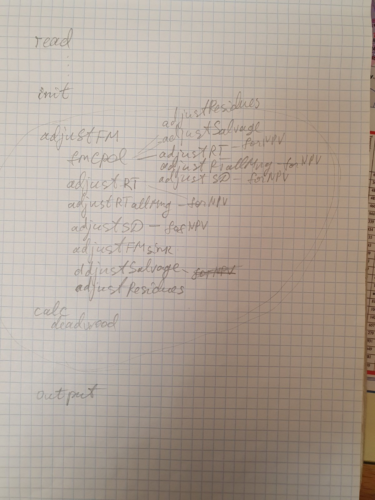

# G4M
I’m rewriting the G4M code using new features of the C++ programming language, optimizing it, including multithread
execution. The G4M model is developed and used at IIASA (https://iiasa.ac.at/models-tools-data/g4m;
https://github.com/iiasa). The model is spatially explicit (in the case of G4M means considering geographic coordinates
as functions' parameters explicitly), it operates on a 0.5x0.5 deg regular grid. The model simulates the behaviour of
virtual landowners in each grid cell, who can afforest, deforest or continue the current use of their land depending on
a comparison of economic outcomes of forest and non-forest land uses. If there is a forest in a grid cell, the model
simulates forest growth and forest management. Also, the model estimates GHG emissions resulting from the land use
change and forest management. The model is used for studying the climate change problem and analysis of the GHG
mitigation policies, including EU policies, e.g. Green Deal
(https://commission.europa.eu/strategy-and-policy/priorities-2019-2024/european-green-deal_en; 
https://climate.ec.europa.eu/eu-action/climate-strategies-targets/economic-analysis/modelling-tools-eu-analysis_en).
The model code uses some open-source scripts developed and put on GitHub by Georg Kindermann 
(https://github.com/GeorgKindermann/g4m) and the other code in private repositories. The model code is written in C++. 
The model code has been developed since 2006 by a few people, usually non-professional programmers.

# Structure
